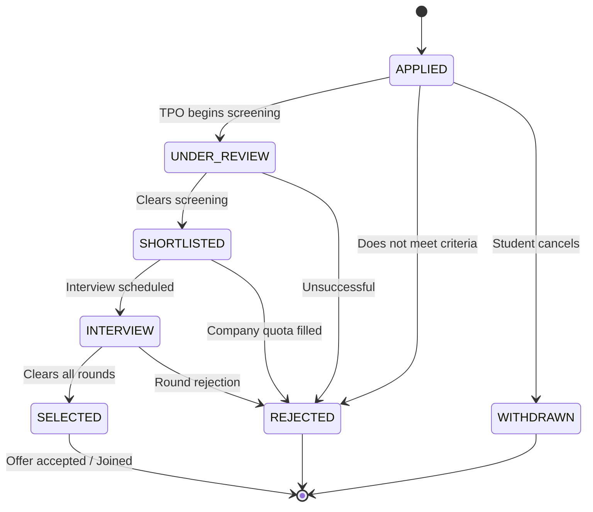

# PlacementOS — Backend Architecture & Service Design

This document details the backend architectural patterns, layered service design, authentication system, role-based access control (RBAC), and business algorithms for **PlacementOS**. The backend is built using **Node.js**, **Express.js**, and **Prisma ORM** with **PostgreSQL**, adhering strictly to the specifications in [PlacementOS_Development_Plan.md](file:///c:/Web%20Development/Web%20Development/Project%202.0/Placement%20OS/Zenith/PlacementOS_Development_Plan.md).

---

## 📌 Table of Contents
- [Layered Architectural Pattern](#layered-architectural-pattern)
- [Directory Layout](#directory-layout)
- [Authentication & Role-Based Access Control (RBAC)](#authentication--role-based-access-control-rbac)
- [Business Logic: The Automated Eligibility Engine](#business-logic-the-automated-eligibility-engine)
- [Application Lifecycle State Machine](#application-lifecycle-state-machine)
- [Error Handling & API Response Standardization](#error-handling--api-response-standardization)
- [Database Access with Prisma](#database-access-with-prisma)
- [Security & Production Hardening](#security--production-hardening)

---

## 🏛️ Layered Architectural Pattern

PlacementOS follows the **Controller-Service-Repository** pattern. This enforces strict separation of concerns, simplifies testing, and keeps route handlers lightweight:

```
[ HTTP Request ]
       │
       ▼
[ Express Router ] ── (Routes URL to specific handlers)
       │
       ▼
[ Middleware Pipeline ] ── (CORS, Rate Limit, Auth JWT, RBAC Guard, Input Validation)
       │
       ▼
[ Controller Layer ] ── (Parses req.body/params, orchestrates services, formats HTTP response)
       │
       ▼
[ Service Layer ] ── (Core Business Logic: Eligibility Engine, Application States, Scoring)
       │
       ▼
[ Data Access Layer (Prisma) ] ── (Type-safe queries against PostgreSQL)
       │
       ▼
[ PostgreSQL Database ]
```

---

## 📂 Directory Layout

The backend directory matches Section 5 of the development plan:

```
backend/
├── prisma/
│   ├── schema.prisma              # Prisma schema definition
│   ├── migrations/                # SQL migration logs
│   └── seed.js                    # Seeder script for mock data & admin accounts
│
├── src/
│   ├── config/                    # Configuration modules
│   │   ├── db.js                  # PrismaClient singleton instance
│   │   └── env.js                 # Environment variable validation
│   │
│   ├── controllers/               # Request handling layer
│   │   ├── authController.js      # Register, login, session check
│   │   ├── studentController.js   # Student profile & skills
│   │   ├── tpoController.js       # TPO student directory & metrics
│   │   ├── driveController.js     # Placement drives & eligibility checks
│   │   ├── internshipController.js# Internship postings
│   │   ├── applicationController.js# Applications submission & status
│   │   ├── interviewController.js # Interview scheduling
│   │   ├── selectionController.js # Offer recording & joining
│   │   ├── assessmentController.js# Quizzes & grading
│   │   ├── resumeController.js    # Resume builder persistence
│   │   └── notificationController.js# Alert dispatch & read receipts
│   │
│   ├── middleware/                # Custom Express middleware
│   │   ├── authMiddleware.js      # JWT verification & req.user injection
│   │   ├── roleMiddleware.js      # Role-Based Access Control (RBAC)
│   │   ├── validateMiddleware.js  # Request validation using Zod
│   │   └── errorHandler.js        # Global error boundary
│   │
│   ├── routes/                    # Route index & endpoint mounts
│   │   ├── index.js               # Master router mounting all sub-routes
│   │   ├── authRoutes.js          # /api/auth
│   │   ├── studentRoutes.js       # /api/students
│   │   ├── tpoRoutes.js           # /api/tpo
│   │   ├── driveRoutes.js         # /api/placement-drives
│   │   ├── internshipRoutes.js    # /api/internships
│   │   ├── applicationRoutes.js   # /api/applications
│   │   ├── interviewRoutes.js     # /api/interviews
│   │   ├── selectionRoutes.js     # /api/selections
│   │   ├── assessmentRoutes.js    # /api/assessments
│   │   ├── resumeRoutes.js        # /api/resumes
│   │   └── notificationRoutes.js  # /api/notifications
│   │
│   ├── services/                  # Business logic layer
│   │   ├── eligibilityService.js  # Student-to-opportunity rule engine
│   │   ├── applicationService.js  # Transition validations & notifications
│   │   ├── assessmentService.js   # Quiz grading & scorecard generation
│   │   └── notificationService.js # System alert generator
│   │
│   └── utils/                     # Utility helpers
│       ├── apiResponse.js         # Standard JSON response formatting
│       ├── password.js            # bcrypt hashing & comparison
│       └── jwt.js                 # Token signing & verification
│
├── .env.example
├── package.json
└── server.js                      # Application bootstrap
```

---

## 🔐 Authentication & Role-Based Access Control (RBAC)

### 1. JWT & Password Hashing Flow
- Passwords are encrypted before database insertion using `bcryptjs` with **10 salt rounds**.
- Upon valid login, an encoded JWT is generated containing:
  ```json
  {
    "userId": "uuid-here",
    "role": "STUDENT",
    "email": "student@college.edu"
  }
  ```
- Expiry is set to `7d` by default.

### 2. RBAC Middleware Implementation
The authorization middleware checks both token authenticity and user permissions:

```javascript
// src/middleware/roleMiddleware.js
export const authorizeRoles = (...allowedRoles) => {
  return (req, res, next) => {
    if (!req.user || !req.user.role) {
      return res.status(401).json({
        success: false,
        message: 'Authentication required'
      });
    }

    if (!allowedRoles.includes(req.user.role)) {
      return res.status(403).json({
        success: false,
        message: `Forbidden: Access restricted to [${allowedRoles.join(', ')}] roles`
      });
    }

    next();
  };
};
```

---

## ⚙️ Business Logic: The Automated Eligibility Engine

The eligibility engine matches students against company criteria entered by the TPO.

### Eligibility Criteria Rules
A student is eligible for a placement drive or internship if and only if all 4 conditions are met:
1. **Department Match**: The student's department must be included in `eligibleBranches`.
2. **CGPA Threshold**: The student's cumulative GPA must be greater than or equal to `minCgpa`.
3. **Active Backlogs**: The student's active arrears must not exceed `maxBacklogs` (typically 0).
4. **Graduation Batch**: The student's batch year must match `eligibleBatch`.

### Algorithm Implementation
```javascript
// src/services/eligibilityService.js

/**
 * Evaluates whether a student is eligible for a given drive.
 * Returns boolean and an itemized breakdown of checks for student clarity.
 */
export function evaluateEligibility(student, drive) {
  const departmentMatch = drive.eligibleBranches.some(
    (branch) => branch.toUpperCase() === student.department.toUpperCase()
  );
  const cgpaMatch = Number(student.cgpa) >= Number(drive.minCgpa);
  const backlogsMatch = student.activeBacklogs <= drive.maxBacklogs;
  const batchMatch = student.batchYear === drive.eligibleBatch;

  const isEligible = departmentMatch && cgpaMatch && backlogsMatch && batchMatch;

  let failureReasons = [];
  if (!departmentMatch) failureReasons.push(`Branch '${student.department}' is not eligible.`);
  if (!cgpaMatch) failureReasons.push(`CGPA (${student.cgpa}) is below the required ${drive.minCgpa}.`);
  if (!backlogsMatch) failureReasons.push(`Active backlogs (${student.activeBacklogs}) exceed the limit of ${drive.maxBacklogs}.`);
  if (!batchMatch) failureReasons.push(`Batch (${student.batchYear}) does not match target batch ${drive.eligibleBatch}.`);

  return {
    isEligible,
    failureReasons,
    breakdown: {
      department: { passed: departmentMatch, student: student.department, required: drive.eligibleBranches },
      cgpa: { passed: cgpaMatch, student: Number(student.cgpa), required: Number(drive.minCgpa) },
      backlogs: { passed: backlogsMatch, student: student.activeBacklogs, allowed: drive.maxBacklogs },
      batch: { passed: batchMatch, student: student.batchYear, required: drive.eligibleBatch }
    }
  };
}
```

---

## 🔄 Application Lifecycle State Machine

Application status progresses through a defined state pipeline:



### Transition Guard Rules
- Only **TPO** can transition status between `UNDER_REVIEW`, `SHORTLISTED`, `INTERVIEW`, `SELECTED`, and `REJECTED`.
- Only **STUDENT** can transition status to `WITHDRAWN`, and only while the status is `APPLIED`.
- Transitioning to `INTERVIEW` requires at least one scheduled round in `interviews`.
- Transitioning to `SELECTED` prompts the creation of a `selection_results` record and updates the student's `placementStatus` to `true`.

---

## 🛑 Error Handling & API Response Standardization

### Global Error Handling Middleware
All errors propagate to a single centralized error handler:

```javascript
// src/middleware/errorHandler.js
export const errorHandler = (err, req, res, next) => {
  console.error(`[Error] ${req.method} ${req.originalUrl}:`, err);

  // Prisma Unique Constraint Violation
  if (err.code === 'P2002') {
    return res.status(409).json({
      success: false,
      message: `A record with this ${err.meta?.target?.join(', ')} already exists.`
    });
  }

  // Zod Validation Error
  if (err.name === 'ZodError') {
    return res.status(400).json({
      success: false,
      message: 'Validation failed',
      error: {
        code: 'VALIDATION_ERROR',
        details: err.errors
      }
    });
  }

  const statusCode = err.statusCode || 500;
  return res.status(statusCode).json({
    success: false,
    message: err.message || 'Internal Server Error'
  });
};
```

---

## 🗃️ Database Access with Prisma

A shared PrismaClient singleton prevents database connection pool exhaustion in development hot-reloading:

```javascript
// src/config/db.js
import { PrismaClient } from '@prisma/client';

const prismaClientSingleton = () => {
  return new PrismaClient({
    log: process.env.NODE_ENV === 'development' ? ['query', 'error', 'warn'] : ['error']
  });
};

const globalForPrisma = globalThis;
export const prisma = globalForPrisma.prisma ?? prismaClientSingleton();

if (process.env.NODE_ENV !== 'production') globalForPrisma.prisma = prisma;
```

---

## 🛡️ Security & Production Hardening

1. **Helmet**: Secures HTTP response headers against clickjacking, cross-site scripting, and sniffing.
2. **CORS Configuration**: Restricts origin requests exclusively to the Next.js frontend domain (`CLIENT_URL`).
3. **Express Rate Limiter**: Guards login and registration endpoints against brute-force attacks (max 100 requests per 15-minute window).
4. **SQL Injection Protection**: Guaranteed out-of-the-box by Prisma's parameterized queries.
