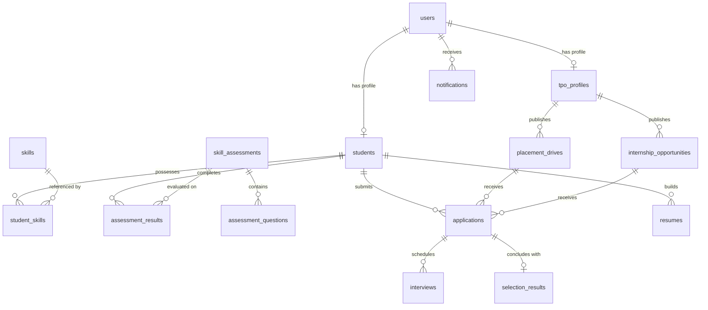

# PlacementOS — Database Schema & Data Dictionary

This document specifies the complete PostgreSQL database architecture and Prisma ORM data model for **PlacementOS**. It translates the 15 database tables and workflows outlined in [PlacementOS_Development_Plan.md](file:///c:/Web%20Development/Web%20Development/Project%202.0/Placement%20OS/Zenith/PlacementOS_Development_Plan.md) into an enterprise-ready relational schema.

---

## 📌 Table of Contents
- [Entity-Relationship Diagram (ERD)](#entity-relationship-diagram-erd)
- [Enums & Custom Types](#enums--custom-types)
- [Data Dictionary (15 Core Tables)](#data-dictionary-15-core-tables)
  - [1. users](#1-users)
  - [2. students](#2-students)
  - [3. tpo_profiles](#3-tpo_profiles)
  - [4. skills](#4-skills)
  - [5. student_skills](#5-student_skills)
  - [6. skill_assessments](#6-skill_assessments)
  - [7. assessment_questions](#7-assessment_questions)
  - [8. assessment_results](#8-assessment_results)
  - [9. placement_drives](#9-placement_drives)
  - [10. internship_opportunities](#10-internship_opportunities)
  - [11. applications](#11-applications)
  - [12. interviews](#12-interviews)
  - [13. selection_results](#13-selection_results)
  - [14. resumes](#14-resumes)
  - [15. notifications](#15-notifications)
- [Indexing & Performance Optimization](#indexing--performance-optimization)
- [Prisma Schema Reference (`schema.prisma`)](#prisma-schema-reference-schemaprisma)

---

## 🗺️ Entity-Relationship Diagram (ERD)



---

## 🏷️ Enums & Custom Types

### `Role`
- `STUDENT`: Normal student user with access to the Student Dashboard.
- `TPO`: Training & Placement Officer or Institutional Admin with access to the TPO Command Center.

### `ApplicationStatus`
- `APPLIED`: Application submitted by student.
- `UNDER_REVIEW`: TPO or recruiting team is screening profile.
- `SHORTLISTED`: Student met initial criteria and moved forward.
- `INTERVIEW`: Student is actively in interview rounds.
- `SELECTED`: Student received and accepted/recorded an offer.
- `REJECTED`: Application not selected by recruiter.
- `WITHDRAWN`: Application retracted by student.

### `DriveStatus`
- `UPCOMING`: Opportunity scheduled for future release.
- `ACTIVE`: Actively accepting applications.
- `CLOSED`: Application window passed; interviews or processing in progress.
- `COMPLETED`: Drive concluded, selections finalized.

### `OpportunityType`
- `PLACEMENT`: Full-time permanent placement drive.
- `INTERNSHIP`: Internship opportunity.
- `INTERNSHIP_PLUS_PPO`: Internship with pre-placement offer possibility.

### `InterviewMode`
- `ONLINE`: Conducted via video link (Google Meet, Zoom, MS Teams).
- `OFFLINE`: Conducted on-campus or at company offices.
- `HYBRID`: Multi-round drive combining online and offline stages.

### `InterviewStatus`
- `SCHEDULED`: Interview date/time confirmed.
- `RESCHEDULED`: Time/date updated.
- `COMPLETED`: Round completed by student.
- `CANCELLED`: Interview round cancelled.

---

## 🗄️ Data Dictionary (15 Core Tables)

### 1. `users`
Central authentication store for all system actors.

| Column | Type | Constraints | Description |
| :--- | :--- | :--- | :--- |
| `id` | `UUID` | PK, default `gen_random_uuid()` | Unique user identifier |
| `email` | `VARCHAR(255)` | UNIQUE, NOT NULL | College or personal email address |
| `password_hash`| `VARCHAR(255)` | NOT NULL | Salted bcrypt hash |
| `role` | `Role` | NOT NULL, default `STUDENT` | System role (`STUDENT` or `TPO`) |
| `is_active` | `BOOLEAN` | NOT NULL, default `true` | Account active state |
| `created_at` | `TIMESTAMP` | NOT NULL, default `NOW()` | Registration timestamp |
| `updated_at` | `TIMESTAMP` | NOT NULL, default `NOW()` | Record update timestamp |

---

### 2. `students`
Extended profile for students containing academic eligibility metrics.

| Column | Type | Constraints | Description |
| :--- | :--- | :--- | :--- |
| `id` | `UUID` | PK, default `gen_random_uuid()` | Unique student profile ID |
| `user_id` | `UUID` | UNIQUE, FK -> `users.id`, ON DELETE CASCADE | Associated user account |
| `roll_number` | `VARCHAR(50)` | UNIQUE, NOT NULL | College roll or enrollment number |
| `first_name` | `VARCHAR(100)`| NOT NULL | Student's given name |
| `last_name` | `VARCHAR(100)`| NOT NULL | Student's family name |
| `phone` | `VARCHAR(20)` | Nullable | Primary contact number |
| `department` | `VARCHAR(100)`| NOT NULL | Department (e.g. `CSE`, `IT`, `ECE`, `MECH`) |
| `batch_year` | `INT` | NOT NULL | Graduation batch year (e.g. `2027`) |
| `cgpa` | `DECIMAL(4,2)`| NOT NULL | Current cumulative GPA (0.00 to 10.00) |
| `tenth_percentage`| `DECIMAL(5,2)`| Nullable | 10th standard percentage |
| `twelfth_percentage`| `DECIMAL(5,2)`| Nullable | 12th / Diploma percentage |
| `active_backlogs`| `INT` | NOT NULL, default `0` | Number of currently active arrears |
| `total_backlogs` | `INT` | NOT NULL, default `0` | Total history of backlogs |
| `placement_status`| `BOOLEAN` | NOT NULL, default `false` | True if student already placed |
| `github_url` | `VARCHAR(255)`| Nullable | GitHub profile link |
| `linkedin_url` | `VARCHAR(255)`| Nullable | LinkedIn profile link |
| `portfolio_url`| `VARCHAR(255)`| Nullable | Personal website / portfolio |
| `created_at` | `TIMESTAMP` | NOT NULL, default `NOW()` | Record creation timestamp |
| `updated_at` | `TIMESTAMP` | NOT NULL, default `NOW()` | Record update timestamp |

---

### 3. `tpo_profiles`
Administrative details for Training & Placement Officers.

| Column | Type | Constraints | Description |
| :--- | :--- | :--- | :--- |
| `id` | `UUID` | PK, default `gen_random_uuid()` | Unique TPO profile ID |
| `user_id` | `UUID` | UNIQUE, FK -> `users.id`, ON DELETE CASCADE | Associated user account |
| `full_name` | `VARCHAR(150)`| NOT NULL | Officer full name |
| `designation` | `VARCHAR(100)`| NOT NULL | Official title (e.g. `Head - Placement Cell`) |
| `department` | `VARCHAR(100)`| Nullable | Affiliated college/department |
| `phone` | `VARCHAR(20)` | Nullable | Office contact phone |
| `created_at` | `TIMESTAMP` | NOT NULL, default `NOW()` | Creation timestamp |
| `updated_at` | `TIMESTAMP` | NOT NULL, default `NOW()` | Update timestamp |

---

### 4. `skills`
Master catalog of technical, functional, and soft skills.

| Column | Type | Constraints | Description |
| :--- | :--- | :--- | :--- |
| `id` | `UUID` | PK, default `gen_random_uuid()` | Skill identifier |
| `name` | `VARCHAR(100)`| UNIQUE, NOT NULL | Skill name (e.g. `React`, `Python`, `Docker`) |
| `category` | `VARCHAR(50)` | Nullable | Category (e.g. `Frontend`, `Database`, `DevOps`) |
| `created_at` | `TIMESTAMP` | NOT NULL, default `NOW()` | Creation timestamp |

---

### 5. `student_skills`
Many-to-many relationship linking students to skills with proficiency ratings.

| Column | Type | Constraints | Description |
| :--- | :--- | :--- | :--- |
| `id` | `UUID` | PK, default `gen_random_uuid()` | Association ID |
| `student_id` | `UUID` | FK -> `students.id`, ON DELETE CASCADE | Target student |
| `skill_id` | `UUID` | FK -> `skills.id`, ON DELETE CASCADE | Target skill |
| `proficiency` | `VARCHAR(20)` | NOT NULL, default `INTERMEDIATE` | `BEGINNER`, `INTERMEDIATE`, `ADVANCED` |
| `created_at` | `TIMESTAMP` | NOT NULL, default `NOW()` | Added timestamp |

*Unique constraint on `(student_id, skill_id)`.*

---

### 6. `skill_assessments`
Master tests created for self-evaluation and preparation.

| Column | Type | Constraints | Description |
| :--- | :--- | :--- | :--- |
| `id` | `UUID` | PK, default `gen_random_uuid()` | Assessment ID |
| `title` | `VARCHAR(200)`| NOT NULL | Test title (e.g. `Java Core & OOP Quiz`) |
| `description` | `TEXT` | Nullable | Brief test overview |
| `category` | `VARCHAR(50)` | NOT NULL | `TECHNICAL`, `APTITUDE`, `CODING` |
| `time_limit_minutes`| `INT` | NOT NULL, default `30` | Allowed duration in minutes |
| `total_questions`| `INT` | NOT NULL, default `10` | Total questions in assessment |
| `passing_score`| `INT` | NOT NULL, default `60` | Minimum passing score percentage |
| `created_at` | `TIMESTAMP` | NOT NULL, default `NOW()` | Creation timestamp |
| `updated_at` | `TIMESTAMP` | NOT NULL, default `NOW()` | Update timestamp |

---

### 7. `assessment_questions`
Question bank tied to specific assessments.

| Column | Type | Constraints | Description |
| :--- | :--- | :--- | :--- |
| `id` | `UUID` | PK, default `gen_random_uuid()` | Question ID |
| `assessment_id`| `UUID` | FK -> `skill_assessments.id`, ON DELETE CASCADE | Parent assessment |
| `question_text`| `TEXT` | NOT NULL | Question wording |
| `options` | `JSONB` | NOT NULL | Array of 4 option strings |
| `correct_option_index`| `INT`| NOT NULL | Zero-indexed correct option (0, 1, 2, 3) |
| `explanation` | `TEXT` | Nullable | Solution explanation displayed post-test |
| `created_at` | `TIMESTAMP` | NOT NULL, default `NOW()` | Timestamp |

---

### 8. `assessment_results`
Individual student test attempts and scorecards.

| Column | Type | Constraints | Description |
| :--- | :--- | :--- | :--- |
| `id` | `UUID` | PK, default `gen_random_uuid()` | Result ID |
| `student_id` | `UUID` | FK -> `students.id`, ON DELETE CASCADE | Student who took test |
| `assessment_id`| `UUID` | FK -> `skill_assessments.id`, ON DELETE CASCADE | Assessment taken |
| `score` | `INT` | NOT NULL | Scored percentage (0 to 100) |
| `passed` | `BOOLEAN` | NOT NULL | True if score >= passing_score |
| `answers` | `JSONB` | NOT NULL | Student's submitted answers array |
| `completed_at` | `TIMESTAMP` | NOT NULL, default `NOW()` | Submission timestamp |

---

### 9. `placement_drives`
Full-time corporate hiring drives published by the TPO.

| Column | Type | Constraints | Description |
| :--- | :--- | :--- | :--- |
| `id` | `UUID` | PK, default `gen_random_uuid()` | Placement drive ID |
| `tpo_id` | `UUID` | FK -> `tpo_profiles.id` | TPO officer who created drive |
| `company_name` | `VARCHAR(200)`| NOT NULL | Name of hiring company |
| `company_logo` | `VARCHAR(255)`| Nullable | Logo URL or asset path |
| `job_role` | `VARCHAR(150)`| NOT NULL | Role title (e.g. `Associate Software Engineer`) |
| `job_description`| `TEXT` | NOT NULL | Responsibilities and details |
| `package_ctc` | `DECIMAL(10,2)`| NOT NULL | CTC in LPA (e.g. `8.50`) |
| `location` | `VARCHAR(150)`| NOT NULL | Job location (e.g. `Bangalore / Hybrid`) |
| `eligible_branches`| `VARCHAR[]` | NOT NULL | Array of branches (`['CSE', 'IT', 'ECE']`) |
| `min_cgpa` | `DECIMAL(4,2)`| NOT NULL, default `6.0` | Minimum CGPA required |
| `max_backlogs` | `INT` | NOT NULL, default `0` | Max active arrears allowed |
| `eligible_batch`| `INT` | NOT NULL | Eligible batch year (e.g. `2027`) |
| `skills_required`| `VARCHAR[]` | Nullable | Required skill tags |
| `deadline` | `TIMESTAMP` | NOT NULL | Last date & time to submit application |
| `drive_date` | `TIMESTAMP` | Nullable | Tentative date of recruitment drive |
| `status` | `DriveStatus` | NOT NULL, default `ACTIVE` | `UPCOMING`, `ACTIVE`, `CLOSED`, `COMPLETED` |
| `created_at` | `TIMESTAMP` | NOT NULL, default `NOW()` | Creation timestamp |
| `updated_at` | `TIMESTAMP` | NOT NULL, default `NOW()` | Update timestamp |

---

### 10. `internship_opportunities`
Internship postings managed by the TPO.

| Column | Type | Constraints | Description |
| :--- | :--- | :--- | :--- |
| `id` | `UUID` | PK, default `gen_random_uuid()` | Internship ID |
| `tpo_id` | `UUID` | FK -> `tpo_profiles.id` | TPO officer who created internship |
| `company_name` | `VARCHAR(200)`| NOT NULL | Company name |
| `company_logo` | `VARCHAR(255)`| Nullable | Logo URL or asset path |
| `role_title` | `VARCHAR(150)`| NOT NULL | Internship title (e.g. `Backend Intern`) |
| `description` | `TEXT` | NOT NULL | Detailed work scope |
| `duration_months`| `INT` | NOT NULL | Duration (e.g. `6`) |
| `stipend_amount`| `DECIMAL(10,2)`| NOT NULL, default `0.0` | Monthly stipend (e.g. `25000.00`) |
| `location` | `VARCHAR(150)`| NOT NULL | Location or Remote |
| `eligible_branches`| `VARCHAR[]` | NOT NULL | Array of eligible departments |
| `min_cgpa` | `DECIMAL(4,2)`| NOT NULL, default `6.0` | Cutoff CGPA |
| `max_backlogs` | `INT` | NOT NULL, default `0` | Max active backlogs |
| `eligible_batch`| `INT` | NOT NULL | Target graduation batch |
| `deadline` | `TIMESTAMP` | NOT NULL | Application deadline |
| `has_ppo_opportunity`| `BOOLEAN` | NOT NULL, default `false` | Potential for Pre-Placement Offer |
| `status` | `DriveStatus` | NOT NULL, default `ACTIVE` | Status lifecycle |
| `created_at` | `TIMESTAMP` | NOT NULL, default `NOW()` | Creation timestamp |
| `updated_at` | `TIMESTAMP` | NOT NULL, default `NOW()` | Update timestamp |

---

### 11. `applications`
Central table connecting students to either a placement drive or an internship.

| Column | Type | Constraints | Description |
| :--- | :--- | :--- | :--- |
| `id` | `UUID` | PK, default `gen_random_uuid()` | Application ID |
| `student_id` | `UUID` | FK -> `students.id`, ON DELETE CASCADE | Applicant student |
| `drive_id` | `UUID` | Nullable, FK -> `placement_drives.id` | If applying for placement drive |
| `internship_id`| `UUID` | Nullable, FK -> `internship_opportunities.id`| If applying for internship |
| `resume_id` | `UUID` | Nullable, FK -> `resumes.id` | Specific resume snapshot attached |
| `status` | `ApplicationStatus`| NOT NULL, default `APPLIED` | Current lifecycle stage |
| `remarks` | `TEXT` | Nullable | Notes from TPO reviewer |
| `applied_at` | `TIMESTAMP` | NOT NULL, default `NOW()` | Application submission timestamp |
| `updated_at` | `TIMESTAMP` | NOT NULL, default `NOW()` | Status transition timestamp |

*Check constraint: Either `drive_id` IS NOT NULL OR `internship_id` IS NOT NULL.*
*Unique constraints: `(student_id, drive_id)` and `(student_id, internship_id)` to prevent duplicate submissions.*

---

### 12. `interviews`
Interview scheduling details managed by TPO.

| Column | Type | Constraints | Description |
| :--- | :--- | :--- | :--- |
| `id` | `UUID` | PK, default `gen_random_uuid()` | Interview ID |
| `application_id`| `UUID` | FK -> `applications.id`, ON DELETE CASCADE | Associated application |
| `round_number` | `INT` | NOT NULL, default `1` | Round sequence (1, 2, 3...) |
| `round_name` | `VARCHAR(100)`| NOT NULL | e.g. `Technical Round 1`, `HR Interview` |
| `scheduled_at` | `TIMESTAMP` | NOT NULL | Scheduled interview date & time |
| `mode` | `InterviewMode`| NOT NULL, default `ONLINE` | `ONLINE`, `OFFLINE`, `HYBRID` |
| `venue_or_link`| `TEXT` | NOT NULL | Meeting URL (e.g. Google Meet) or Hall # |
| `instructions` | `TEXT` | Nullable | Guidelines for the candidate |
| `status` | `InterviewStatus`| NOT NULL, default `SCHEDULED`| Schedule state |
| `feedback` | `TEXT` | Nullable | Recruiter remarks/outcome |
| `created_at` | `TIMESTAMP` | NOT NULL, default `NOW()` | Record created |
| `updated_at` | `TIMESTAMP` | NOT NULL, default `NOW()` | Record updated |

---

### 13. `selection_results`
Final job offers, acceptance records, and joining status.

| Column | Type | Constraints | Description |
| :--- | :--- | :--- | :--- |
| `id` | `UUID` | PK, default `gen_random_uuid()` | Selection result ID |
| `application_id`| `UUID` | UNIQUE, FK -> `applications.id`, ON DELETE CASCADE | Winning application |
| `company_name` | `VARCHAR(200)`| NOT NULL | Hiring company name |
| `offered_package`| `DECIMAL(10,2)`| NOT NULL | Package/Stipend offered |
| `offer_letter_url`| `VARCHAR(255)`| Nullable | Link to uploaded offer letter |
| `offer_date` | `DATE` | NOT NULL | Date offer was issued |
| `joining_date` | `DATE` | Nullable | Expected joining date |
| `is_accepted` | `BOOLEAN` | NOT NULL, default `true` | Accepted by student |
| `has_joined` | `BOOLEAN` | NOT NULL, default `false`| Confirmed joined |
| `created_at` | `TIMESTAMP` | NOT NULL, default `NOW()` | Record creation |

---

### 14. `resumes`
Structured resume snapshots created via the student Resume Builder.

| Column | Type | Constraints | Description |
| :--- | :--- | :--- | :--- |
| `id` | `UUID` | PK, default `gen_random_uuid()` | Resume ID |
| `student_id` | `UUID` | FK -> `students.id`, ON DELETE CASCADE | Target student |
| `title` | `VARCHAR(100)`| NOT NULL, default `Default Resume` | User-defined title |
| `template_name`| `VARCHAR(50)` | NOT NULL, default `modern` | Layout theme (`modern`, `classic`, `minimal`) |
| `content_json` | `JSONB` | NOT NULL | Full structured data (education, projects, skills) |
| `pdf_url` | `VARCHAR(255)`| Nullable | Generated PDF asset path if stored |
| `is_default` | `BOOLEAN` | NOT NULL, default `false`| Default resume for quick apply |
| `created_at` | `TIMESTAMP` | NOT NULL, default `NOW()` | Creation timestamp |
| `updated_at` | `TIMESTAMP` | NOT NULL, default `NOW()` | Update timestamp |

---

### 15. `notifications`
Notification alerts dispatched to users.

| Column | Type | Constraints | Description |
| :--- | :--- | :--- | :--- |
| `id` | `UUID` | PK, default `gen_random_uuid()` | Notification ID |
| `user_id` | `UUID` | FK -> `users.id`, ON DELETE CASCADE | Target user |
| `title` | `VARCHAR(200)`| NOT NULL | Alert title |
| `message` | `TEXT` | NOT NULL | Detailed message body |
| `type` | `VARCHAR(50)` | NOT NULL, default `SYSTEM` | `DRIVE_ALERT`, `APPLICATION_UPDATE`, `INTERVIEW` |
| `link` | `VARCHAR(255)`| Nullable | Action link (e.g. `/student/applications/123`) |
| `is_read` | `BOOLEAN` | NOT NULL, default `false` | Read status |
| `created_at` | `TIMESTAMP` | NOT NULL, default `NOW()` | Alert delivery timestamp |

---

## ⚡ Indexing & Performance Optimization

To guarantee sub-100ms response times on large college cohorts (thousands of students and drive applications), the following indexes are specified in Prisma:

1. **`users(email)`**: Fast lookup during JWT authentication.
2. **`students(department, batch_year, cgpa, active_backlogs)`**: Compound filtering in the TPO Student Directory and automated eligibility evaluations.
3. **`placement_drives(status, deadline, eligible_batch)`**: Instant retrieval of active, unexpired drives for students.
4. **`applications(student_id, status)`**: Instant loading of the "My Applications" student tracker.
5. **`applications(drive_id, status)`**: Fast listing of applicants for TPO candidate shortlisting.
6. **`notifications(user_id, is_read)`**: Rapid retrieval of unread alert counts.

---

## 📜 Prisma Schema Reference (`schema.prisma`)

```prisma
datasource db {
  provider = "postgresql"
  url      = env("DATABASE_URL")
}

generator client {
  provider = "prisma-client-js"
}

enum Role {
  STUDENT
  TPO
}

enum ApplicationStatus {
  APPLIED
  UNDER_REVIEW
  SHORTLISTED
  INTERVIEW
  SELECTED
  REJECTED
  WITHDRAWN
}

enum DriveStatus {
  UPCOMING
  ACTIVE
  CLOSED
  COMPLETED
}

enum InterviewMode {
  ONLINE
  OFFLINE
  HYBRID
}

enum InterviewStatus {
  SCHEDULED
  RESCHEDULED
  COMPLETED
  CANCELLED
}

model User {
  id           String        @id @default(uuid()) @db.Uuid
  email        String        @unique @db.VarChar(255)
  passwordHash String        @map("password_hash") @db.VarChar(255)
  role         Role          @default(STUDENT)
  isActive     Boolean       @default(true) @map("is_active")
  createdAt    DateTime      @default(now()) @map("created_at")
  updatedAt    DateTime      @updatedAt @map("updated_at")

  student      Student?
  tpoProfile   TpoProfile?
  notifications Notification[]

  @@map("users")
}

model Student {
  id               String            @id @default(uuid()) @db.Uuid
  userId           String            @unique @map("user_id") @db.Uuid
  rollNumber       String            @unique @map("roll_number") @db.VarChar(50)
  firstName        String            @map("first_name") @db.VarChar(100)
  lastName         String            @map("last_name") @db.VarChar(100)
  phone            String?           @db.VarChar(20)
  department       String            @db.VarChar(100)
  batchYear        Int               @map("batch_year")
  cgpa             Decimal           @db.Decimal(4, 2)
  tenthPercentage  Decimal?          @map("tenth_percentage") @db.Decimal(5, 2)
  twelfthPercentage Decimal?         @map("twelfth_percentage") @db.Decimal(5, 2)
  activeBacklogs   Int               @default(0) @map("active_backlogs")
  totalBacklogs    Int               @default(0) @map("total_backlogs")
  placementStatus  Boolean           @default(false) @map("placement_status")
  githubUrl        String?           @map("github_url") @db.VarChar(255)
  linkedinUrl      String?           @map("linkedin_url") @db.VarChar(255)
  portfolioUrl     String?           @map("portfolio_url") @db.VarChar(255)
  createdAt        DateTime          @default(now()) @map("created_at")
  updatedAt        DateTime          @updatedAt @map("updated_at")

  user             User              @relation(fields: [userId], references: [id], onDelete: Cascade)
  skills           StudentSkill[]
  applications     Application[]
  resumes          Resume[]
  assessmentResults AssessmentResult[]

  @@index([department, batchYear, cgpa, activeBacklogs])
  @@map("students")
}

model TpoProfile {
  id          String                  @id @default(uuid()) @db.Uuid
  userId      String                  @unique @map("user_id") @db.Uuid
  fullName    String                  @map("full_name") @db.VarChar(150)
  designation String                  @db.VarChar(100)
  department  String?                 @db.VarChar(100)
  phone       String?                 @db.VarChar(20)
  createdAt   DateTime                @default(now()) @map("created_at")
  updatedAt   DateTime                @updatedAt @map("updated_at")

  user        User                    @relation(fields: [userId], references: [id], onDelete: Cascade)
  drives      PlacementDrive[]
  internships InternshipOpportunity[]

  @@map("tpo_profiles")
}

model Skill {
  id        String         @id @default(uuid()) @db.Uuid
  name      String         @unique @db.VarChar(100)
  category  String?        @db.VarChar(50)
  createdAt DateTime       @default(now()) @map("created_at")

  students  StudentSkill[]

  @@map("skills")
}

model StudentSkill {
  id          String   @id @default(uuid()) @db.Uuid
  studentId   String   @map("student_id") @db.Uuid
  skillId     String   @map("skill_id") @db.Uuid
  proficiency String   @default("INTERMEDIATE") @db.VarChar(20)
  createdAt   DateTime @default(now()) @map("created_at")

  student     Student  @relation(fields: [studentId], references: [id], onDelete: Cascade)
  skill       Skill    @relation(fields: [skillId], references: [id], onDelete: Cascade)

  @@unique([studentId, skillId])
  @@map("student_skills")
}

model SkillAssessment {
  id               String               @id @default(uuid()) @db.Uuid
  title            String               @db.VarChar(200)
  description      String?              @db.Text
  category         String               @db.VarChar(50)
  timeLimitMinutes Int                  @default(30) @map("time_limit_minutes")
  totalQuestions   Int                  @default(10) @map("total_questions")
  passingScore     Int                  @default(60) @map("passing_score")
  createdAt        DateTime             @default(now()) @map("created_at")
  updatedAt        DateTime             @updatedAt @map("updated_at")

  questions        AssessmentQuestion[]
  results          AssessmentResult[]

  @@map("skill_assessments")
}

model AssessmentQuestion {
  id                 String          @id @default(uuid()) @db.Uuid
  assessmentId       String          @map("assessment_id") @db.Uuid
  questionText       String          @map("question_text") @db.Text
  options            Json
  correctOptionIndex Int             @map("correct_option_index")
  explanation        String?         @db.Text
  createdAt          DateTime        @default(now()) @map("created_at")

  assessment         SkillAssessment @relation(fields: [assessmentId], references: [id], onDelete: Cascade)

  @@map("assessment_questions")
}

model AssessmentResult {
  id           String          @id @default(uuid()) @db.Uuid
  studentId    String          @map("student_id") @db.Uuid
  assessmentId String          @map("assessment_id") @db.Uuid
  score        Int
  passed       Boolean
  answers      Json
  completedAt  DateTime        @default(now()) @map("completed_at")

  student      Student         @relation(fields: [studentId], references: [id], onDelete: Cascade)
  assessment   SkillAssessment @relation(fields: [assessmentId], references: [id], onDelete: Cascade)

  @@map("assessment_results")
}

model PlacementDrive {
  id               String        @id @default(uuid()) @db.Uuid
  tpoId            String        @map("tpo_id") @db.Uuid
  companyName      String        @map("company_name") @db.VarChar(200)
  companyLogo      String?       @map("company_logo") @db.VarChar(255)
  jobRole          String        @map("job_role") @db.VarChar(150)
  jobDescription   String        @map("job_description") @db.Text
  packageCtc       Decimal       @map("package_ctc") @db.Decimal(10, 2)
  location         String        @db.VarChar(150)
  eligibleBranches String[]      @map("eligible_branches")
  minCgpa          Decimal       @default(6.0) @map("min_cgpa") @db.Decimal(4, 2)
  maxBacklogs      Int           @default(0) @map("max_backlogs")
  eligibleBatch    Int           @map("eligible_batch")
  skillsRequired   String[]      @map("skills_required")
  deadline         DateTime
  driveDate        DateTime?     @map("drive_date")
  status           DriveStatus   @default(ACTIVE)
  createdAt        DateTime      @default(now()) @map("created_at")
  updatedAt        DateTime      @updatedAt @map("updated_at")

  tpo              TpoProfile    @relation(fields: [tpoId], references: [id])
  applications     Application[]

  @@index([status, deadline, eligibleBatch])
  @@map("placement_drives")
}

model InternshipOpportunity {
  id                String        @id @default(uuid()) @db.Uuid
  tpoId             String        @map("tpo_id") @db.Uuid
  companyName       String        @map("company_name") @db.VarChar(200)
  companyLogo       String?       @map("company_logo") @db.VarChar(255)
  roleTitle         String        @map("role_title") @db.VarChar(150)
  description       String        @db.Text
  durationMonths    Int           @map("duration_months")
  stipendAmount     Decimal       @default(0.0) @map("stipend_amount") @db.Decimal(10, 2)
  location          String        @db.VarChar(150)
  eligibleBranches  String[]      @map("eligible_branches")
  minCgpa           Decimal       @default(6.0) @map("min_cgpa") @db.Decimal(4, 2)
  maxBacklogs       Int           @default(0) @map("max_backlogs")
  eligibleBatch     Int           @map("eligible_batch")
  deadline          DateTime
  hasPpoOpportunity Boolean       @default(false) @map("has_ppo_opportunity")
  status            DriveStatus   @default(ACTIVE)
  createdAt         DateTime      @default(now()) @map("created_at")
  updatedAt         DateTime      @updatedAt @map("updated_at")

  tpo               TpoProfile    @relation(fields: [tpoId], references: [id])
  applications      Application[]

  @@index([status, deadline, eligibleBatch])
  @@map("internship_opportunities")
}

model Application {
  id             String                 @id @default(uuid()) @db.Uuid
  studentId      String                 @map("student_id") @db.Uuid
  driveId        String?                @map("drive_id") @db.Uuid
  internshipId   String?                @map("internship_id") @db.Uuid
  resumeId       String?                @map("resume_id") @db.Uuid
  status         ApplicationStatus      @default(APPLIED)
  remarks        String?                @db.Text
  appliedAt      DateTime               @default(now()) @map("applied_at")
  updatedAt      DateTime               @updatedAt @map("updated_at")

  student        Student                @relation(fields: [studentId], references: [id], onDelete: Cascade)
  drive          PlacementDrive?        @relation(fields: [driveId], references: [id], onDelete: Cascade)
  internship     InternshipOpportunity? @relation(fields: [internshipId], references: [id], onDelete: Cascade)
  resume         Resume?                @relation(fields: [resumeId], references: [id])
  interviews     Interview[]
  selectionResult SelectionResult?

  @@unique([studentId, driveId])
  @@unique([studentId, internshipId])
  @@index([studentId, status])
  @@index([driveId, status])
  @@map("applications")
}

model Interview {
  id            String          @id @default(uuid()) @db.Uuid
  applicationId String          @map("application_id") @db.Uuid
  roundNumber   Int             @default(1) @map("round_number")
  roundName     String          @map("round_name") @db.VarChar(100)
  scheduledAt   DateTime        @map("scheduled_at")
  mode          InterviewMode   @default(ONLINE)
  venueOrLink   String          @map("venue_or_link") @db.Text
  instructions  String?         @db.Text
  status        InterviewStatus @default(SCHEDULED)
  feedback      String?         @db.Text
  createdAt     DateTime        @default(now()) @map("created_at")
  updatedAt     DateTime        @updatedAt @map("updated_at")

  application   Application     @relation(fields: [applicationId], references: [id], onDelete: Cascade)

  @@index([applicationId, scheduledAt])
  @@map("interviews")
}

model SelectionResult {
  id              String      @id @default(uuid()) @db.Uuid
  applicationId   String      @unique @map("application_id") @db.Uuid
  companyName     String      @map("company_name") @db.VarChar(200)
  offeredPackage  Decimal     @map("offered_package") @db.Decimal(10, 2)
  offerLetterUrl  String?     @map("offer_letter_url") @db.VarChar(255)
  offerDate       DateTime    @map("offer_date") @db.Date
  joiningDate     DateTime?   @map("joining_date") @db.Date
  isAccepted      Boolean     @default(true) @map("is_accepted")
  hasJoined       Boolean     @default(false) @map("has_joined")
  createdAt       DateTime    @default(now()) @map("created_at")

  application     Application @relation(fields: [applicationId], references: [id], onDelete: Cascade)

  @@map("selection_results")
}

model Resume {
  id           String        @id @default(uuid()) @db.Uuid
  studentId    String        @map("student_id") @db.Uuid
  title        String        @default("Default Resume") @db.VarChar(100)
  templateName String        @default("modern") @map("template_name") @db.VarChar(50)
  contentJson  Json          @map("content_json")
  pdfUrl       String?       @map("pdf_url") @db.VarChar(255)
  isDefault    Boolean       @default(false) @map("is_default")
  createdAt    DateTime      @default(now()) @map("created_at")
  updatedAt    DateTime      @updatedAt @map("updated_at")

  student      Student       @relation(fields: [studentId], references: [id], onDelete: Cascade)
  applications Application[]

  @@map("resumes")
}

model Notification {
  id        String   @id @default(uuid()) @db.Uuid
  userId    String   @map("user_id") @db.Uuid
  title     String   @db.VarChar(200)
  message   String   @db.Text
  type      String   @default("SYSTEM") @db.VarChar(50)
  link      String?  @db.VarChar(255)
  isRead    Boolean  @default(false) @map("is_read")
  createdAt DateTime @default(now()) @map("created_at")

  user      User     @relation(fields: [userId], references: [id], onDelete: Cascade)

  @@index([userId, isRead])
  @@map("notifications")
}
```
